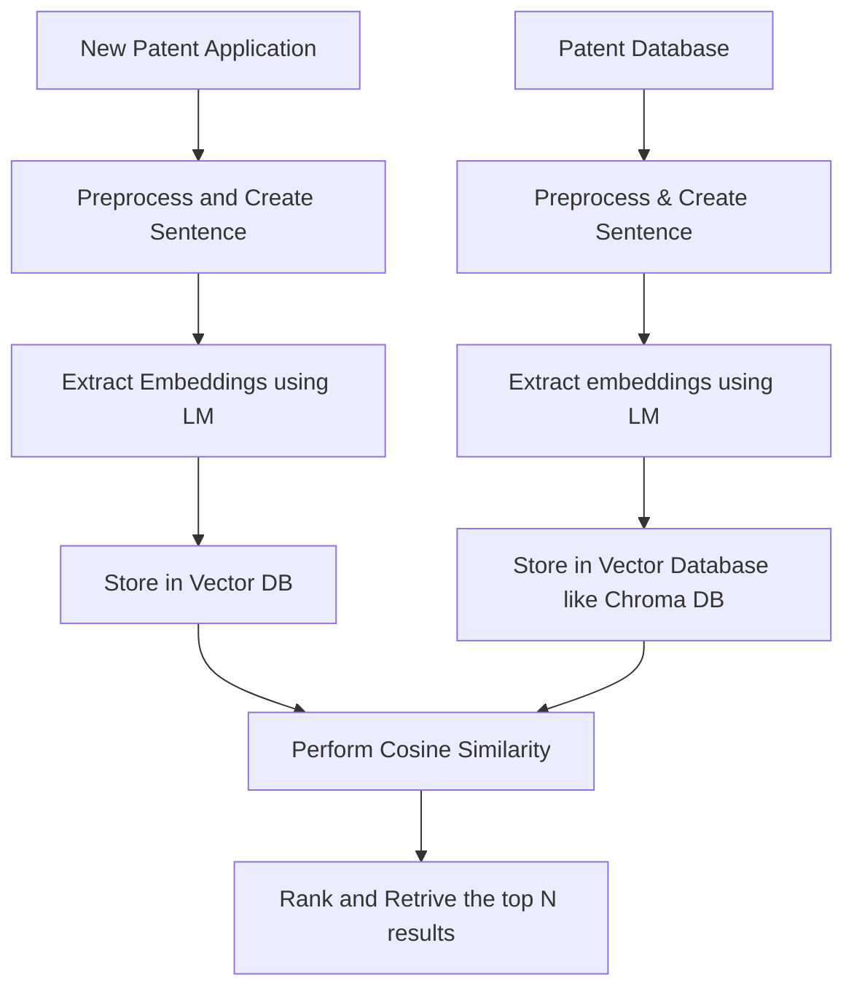

# Automated Patent Relevance System

## AIM
 Help patent officers identify relevant prior patents when reviewing a new patent application.

## Vector Embeddings?       
    

https://github.com/nishJay/AutomatedPatentRelevanceSystem/assets/77871395/57e0023c-f533-4d15-921a-9ca2ecdcf9c0

## Chroma DB

Chroma is an open-source vector database developed by Chroma.ai.

It focuses on scalability, providing robust support for storing and querying large-scale embedding datasets efficiently.

Chroma offers a distributed architecture with horizontal scalability, enabling it to handle massive volumes of vector data.

It leverages Apache Cassandra for high availability and fault tolerance, ensuring data persistence and durability.

One unique aspect of Chroma is its flexible indexing system.

It supports multiple indexing strategies, such as approximate nearest neighbors (ANN) algorithms like HNSW and IVFPQ, enabling fast and accurate similarity searches.

Chroma also provides comprehensive Python and RESTful APIs, making it easily integratable into NLP pipelines

## Adding Docs and Ids to the Chroma DB collection 

1. The input data is validated - the docs and ids lists must be of equal length.
   
2. The documents are tokenized using the default tokenizer (usually a WordPiece tokenizer).
      
3. The tokenized documents are passed through the embedding module (default is MiniLM)

## MiniLM 

## StreamLit Webapp

[Click here to interact with the website](https://patentsearch.streamlit.app/)

