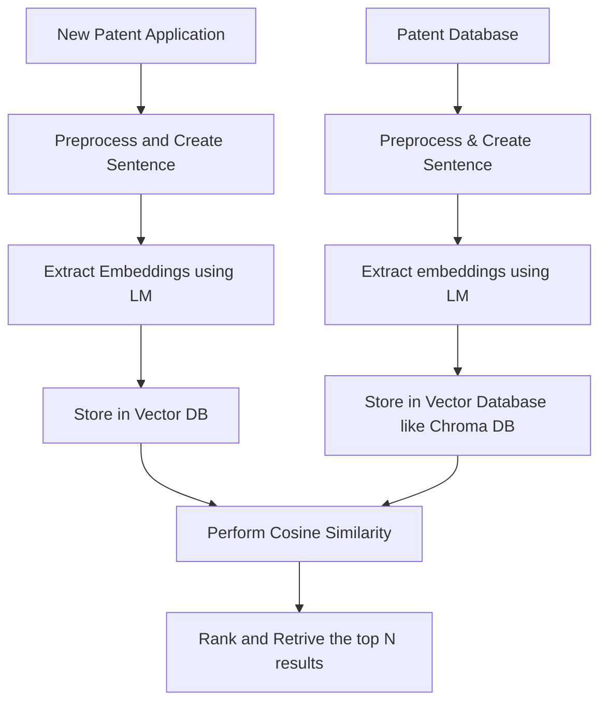

# Automated Patent Relevance System
 Help patent officers identify relevant prior patents when reviewing a new patent application.

```mermaid
graph TD
    A[Patent Database] --> B[Preprocess & Create Sentence]
    B --> C[Extract embeddings using LM]  --> D[Store in Vector Database like Chroma DB]
    E[New Patent Application] --> F[Preprocess and Create Sentence] --> G[Extract Embeddings using LM] --> H[Store in Vector DB]
    H --> I[Perform Cosine Similarity]
    D --> I
    I --> J[Rank and Retrive the top N results]
```

       
    
